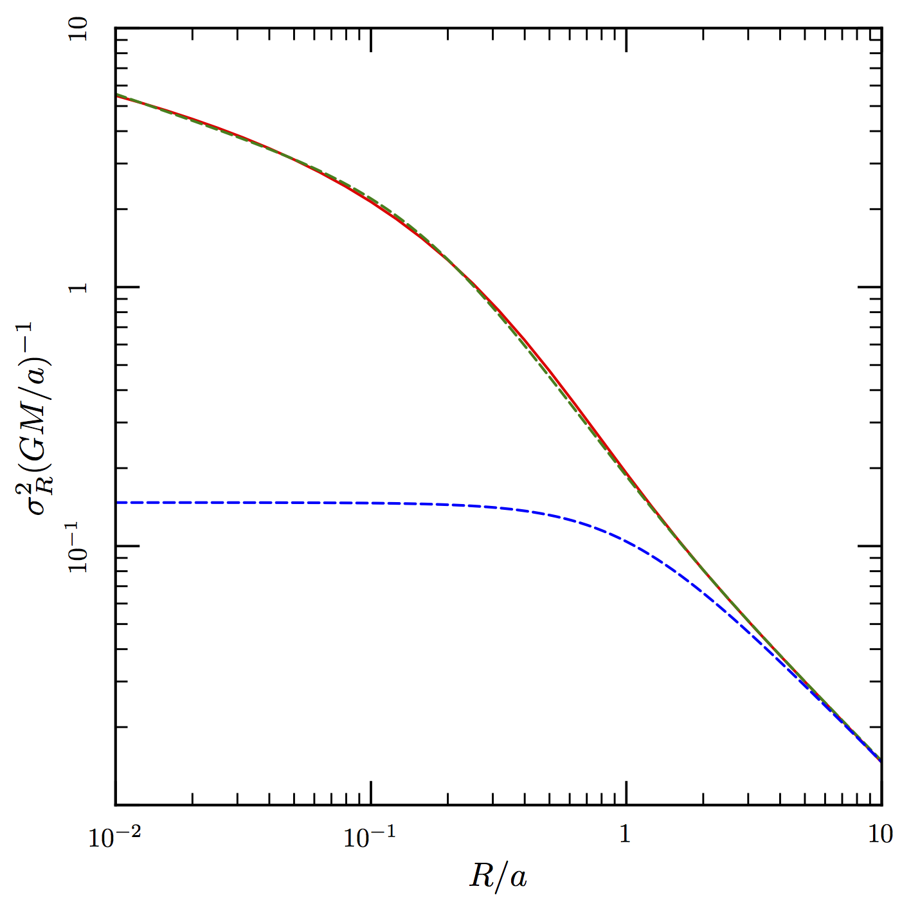

# Plummer Model

Here are some results for the projected quantities for a Plummer model that you can use to fit for the black hole.

The first is the projected surface density:


The second is the projected velocity dispersion squared without the black hole:


The square of the velocity dispersion with the black hole is contained within the file blacksigma2.dat. The projected radius is in the first column; the units for the projected radius are a.  The second column contains the velocity dispersion squared in units of G M<sub>bh</sub>/a.

The strategy is to fit for the value of a using the distribution of stars as a function of projected radius and the first equation.  Once you have a, you can fit for the measured square of the velocity dispersion using a sum of the values from the second equation and the data in the file (you can interpolate through the data points --- it works best using a log-log plot).

Both expressions have G M / a in front so we are really interested in the ratio of the two terms which is the ratio of the BH mass to the total mass of the hole.  You can look at the following figure to get an idea of the effect of the hole.  The lower dashed curve is the velocity dispersion squared of the Plummer model and the solid curve is that caused by the black hole.  Here the BH mass is the same as the cluster.  We can measure the velocity dispersion squared at about 0.1 a and if we find it to be within ten percent of being given by the Plummer model that will constrain the BH mass to be less than 0.5 percent of the mass of the cluster. 



The other dashed curve is a fitted formula for the black hole dispersion squared.  It isn't pretty but you can use it if you want in python.
```
  x**(-1.0/3.0)*3*3.1415/64*(2.5+x**2)**(0.2)*((3*3.1415/64)**(15.0/8.0)+x**2)**(-8.0/15.0) 
```
and in math

 where .

This demonstates how to can make a nice function with a given power-law behavoiur in any regime.  At large values of x, you can add up all of the exponents and see that they add to -1.  For small values of x, you look at the leading term which has an exponent of -1/3.  In between the function actually gets a bit steeper to connect the two regimes, so to have three power-law regimes we need to multiply three terms where the constants that add to the x<sup>2</sup> delineate where the regimes start and end as well as the normalization at small values of x.   The power on the x<sup>2</sup> determines how smoothly the transition from one regime to the next is.  Higher powers give sharper transtions.


# Hernquist Model

Let's repeat the analysis for the Hernquist model that provides a good fit to the brightness profile of elliptical galaxies.  We have


